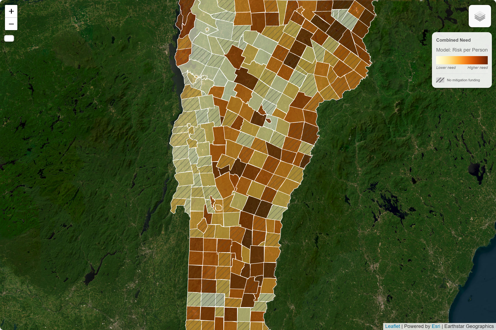
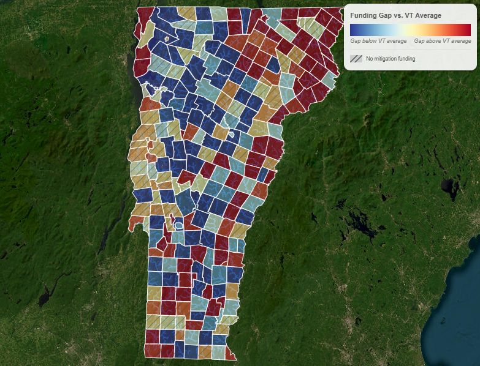
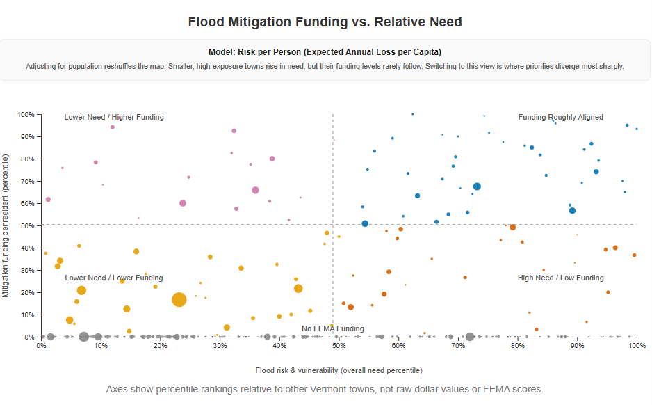
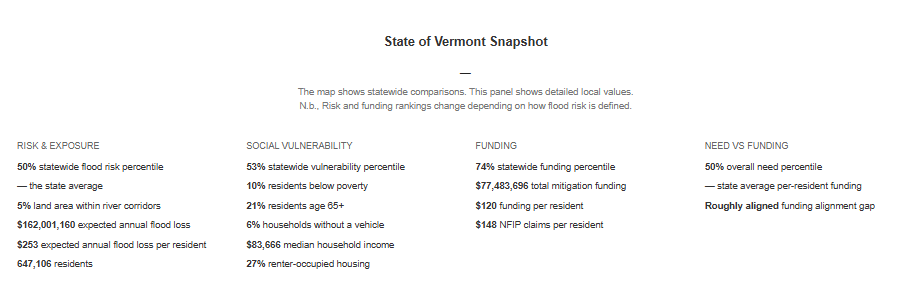
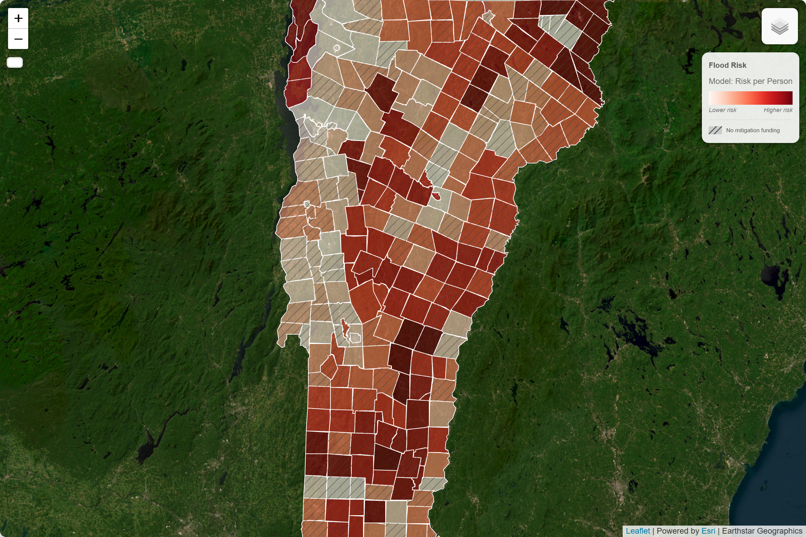
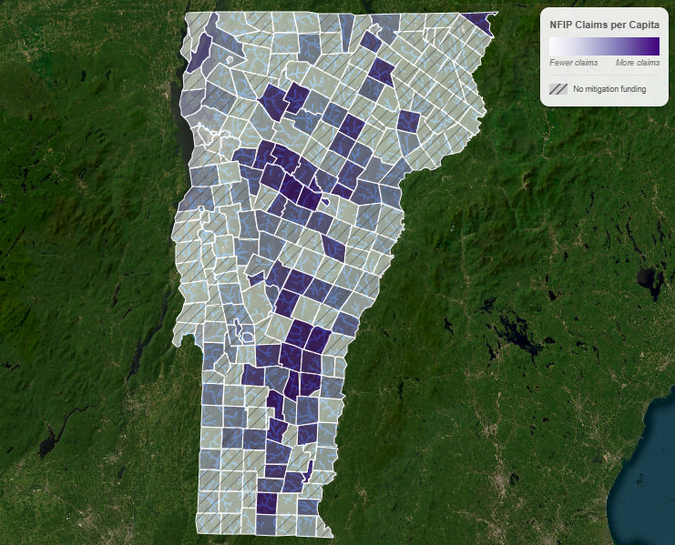

# Floodlines


_Risk is not equally distributed. Neither is the money to address it._

<!-- _Mapping the gap between flood risk and flood funding in Vermont._ -->

🔗 [Live Dashboard](https://johbry17.github.io/Floodlines/)

⚠️ This project is under active development.

## Table of Contents

- [Project Overview](#project-overview)
- [Features](#features)
- [Tools & Technologies](#tools--technologies)
- [Usage](#usage)
- [Gallery](#gallery)
- [Data & Methodology](#data--methodology)
- [References](#references)
- [License](#license)
- [Acknowledgements](#acknowledgements)
- [Author](#author)

## Project Overview

**Floodlines** is an index-based spatial analysis of flood risk, social vulnerability, and FEMA mitigation funding across Vermont's 250+ towns. The central question: _who bears the most risk, who receives the least help, and where is the mismatch greatest?_

Vermont has experienced repeated, severe flood events, most notably Hurricane Irene (2011) and the historic flooding of 2023. Yet federal mitigation funding has not flowed evenly. Some high-risk, high-vulnerability towns have received little to nothing. Others have received substantial investment. This project builds a reproducible, methodologically transparent framework to measure that gap.

The analysis combines:

- **GIS preprocessing** of flood zone, river corridor, and town boundary data
- **ACS demographic data** for town-level social vulnerability (poverty, age, vehicle access, and more)
- **FEMA Hazard Mitigation Assistance (HMA)** funding records, inflation-adjusted to 2025 dollars
- **NFIP** insurance claims and policy data
- **FEMA National Risk Index (NRI)** expected annual loss and composite risk scores
- **Index construction** using rank-based normalization across multiple model specifications, with sensitivity analysis
- **An interactive web dashboard** visualizing risk, vulnerability, need, gap, and quadrant assignment for every Vermont town

Key findings:

- Flood mitigation funding is only weakly correlated with structural need (Spearman ~0.10–0.30 for most models)
- Past insurance claims are a far stronger predictor of funding (Spearman ~0.55), suggesting a reactive rather than proactive allocation pattern
- ~55–60% of Vermont towns are underfunded relative to their measured need
- The index framework is robust to normalization method choice (need-index Spearman z vs. rank: 0.89–1.00)

## Features

**Interactive Dashboard:**

- Quadrant view classifying each town as underfunded, overfunded, aligned, low-priority, or zero-funding
- Choropleth map of all Vermont towns, switchable across six metrics: flood risk, social vulnerability, need index, mitigation funding, funding gap, and NFIP claims
- River corridor, population, and funding context overlays
- Model switcher (EAL, EAL per capita, FEMA NRI)
- Relative-to-state-average toggle for contextualizing local values
- Town-level detail panel with key statistics and percentile rankings
- Scatter plot of need vs. funding, updating dynamically with the active model
- Rankings table showing each town's percentile position across all key metrics
- Responsive layout with mobile support

**Analysis Pipeline:**

- Reproducible ETL notebooks for all data sources (GIS, ACS, FEMA HMA, NFIP, NRI)
- Index construction and model evaluation across 20 model specifications and two normalization methods
- Sensitivity analysis (LOVO, weight perturbation, normalization comparison)
- Quadrant and exclusion analysis
- Spatial autocorrelation (Moran's I)
- Exportable web data with raw scores, percentile ranks, and relative-to-mean values

## Tools & Technologies

**Frontend:** JavaScript, Leaflet.js, D3.js, HTML/CSS  
**Backend:** Python, Pandas, GeoPandas, NumPy, Jupyter Notebook  
**Spatial:** GeoPandas, Shapely, libpysal, ESDA (Moran's I)  
**Statistics:** scikit-learn, scipy, statsmodels  
**Data sources:** U.S. Census / ACS, OpenFEMA, FEMA NFHL, Vermont ANR, FRED CPI  
**Hosting:** GitHub Pages

## Usage

**Live dashboard:**  
🔗 [https://johbry17.github.io/Floodlines/](https://johbry17.github.io/Floodlines/)

**Run the analysis locally:**

1. Clone the repository
2. Install dependencies (Python 3.10+, standard geospatial stack):
   ```bash
   pip install pandas geopandas numpy matplotlib seaborn scikit-learn scipy statsmodels esda libpysal jupyterlab
   ```
3. Run notebooks in order:
   - `01_etl_gis.ipynb` — spatial preprocessing
   - `02_etl_acs.ipynb` through `05_etl_fema_nri.ipynb` — source ETL
   - `09_etl_final_merge.ipynb` — merge all sources
   - `10_eda_overview.ipynb` through `13_eda_hma_nfip.ipynb` — exploratory analysis
   - `20_analysis_build_index.ipynb` — index construction and model evaluation
   - `21_sensitivity_checks.ipynb` — LOVO and weight sensitivity
   - `22_quadrant_and_exclusion_analysis.ipynb` — quadrant assignment
   - `29_export_to_web.ipynb` — generate `town_stats.csv` and `town_boundaries.geojson`

## Gallery

  
*All Vermont towns classified into funding quadrants (high/low funidng, high/low need, zero-funding)*  

  
*Measuring Need: A rank-based composite of flood exposure and social vulnerability*  

  
*Towns where need substantially exceeds FEMA HMA investment, highlighting the most underserved communities*  

  
*Loose cloud confirming weak alignment between structural need and federal mitigation dollars*  

  
*Per-town statistics, percentile rankings, and quadrant classification for a selected community*  

  
*Risk map rescaled to show deviation from the Vermont statewide average rather than absolute percentile rank*  

  
*Reactive benchmark layer showing where insured losses occurred vs. where modeled risk is highest*  

## Data & Methodology

**Index construction:**  
The need index combines a flood risk component (FEMA EAL or river corridor exposure) and a social vulnerability component (poverty rate, percent elderly, percent households without a vehicle), normalized using percentile ranks across all Vermont towns. The gap index is defined as need minus scaled funding — positive values indicate towns receiving less mitigation investment than their need would predict.

**Model selection:**  
Three models were carried forward for the dashboard: `core_EAL_model` (primary — highest logit AUC at 0.70), `eal_per_capita_model` (robustness — most normalization-stable at Spearman 0.97), and `fema_national_risk_index` (benchmark — FEMA's own composite for external validity).  

Claims-based models were excluded because their high need–funding correlation (~0.55) reflects a reactive rather than proactive pattern; their near-zero gap meaningfulness (~0.04) confirms the gap index adds no independent signal when claims drive the need score. Expanded vulnerability specifications (adding housing tenure, disability, mobile homes) were also excluded: increasing the variable count raised normalization sensitivity (mean rank difference 19–21 vs. 13–15 for core models) without improving logit AUC, violating the parsimony criterion. Similarly, simple spatial exposure metrics — river corridor percentage and NFHL flood zone coverage — were replaced by FEMA Expected Annual Loss, which captures both hazard intensity and asset exposure rather than treating all land within a flood polygon as equally at risk.  

The implicit selection principle: parsimony + predictive signal + normalization stability + external benchmarkability.

**Normalization:**  
Rank-based (percentile) normalization was chosen over z-scores for four reasons: robustness to extreme outliers in Vermont flood data, bounded [0,1] output interpretable to general audiences, comparability across variables with incompatible units and distributions, and confirmation from sensitivity analysis that the substantive findings are stable across both methods (need-index Spearman z vs. rank: 0.89–1.00).

**Funding:**  
All FEMA HMA dollar amounts are inflation-adjusted to 2025 dollars using CPI-U (FRED). Only approved projects localizable to a specific town are included; county-wide, regional, and statewide projects (~37% of filtered HMA) are excluded, as are planning and administrative costs. Amounts reflect the federal share obligated (~75% of total project cost).

**NFIP:**  
Claims reflect insured losses only. Fewer than 2% of Vermont housing units are covered by NFIP policies, so claims data systematically underrepresents flood exposure statewide.

## References

- [U.S. Census Bureau, 2025 TIGER/Line Shapefiles: Vermont County Subdivisions](https://www2.census.gov/geo/tiger/TIGER2025/COUSUB/tl_2025_50_cousub.zip)  
  Used for Vermont town (county subdivision) boundaries and spatial joins.

- [U.S. Census Bureau, 2025 TIGER/Line Shapefiles: Vermont Areawater (Chittenden County)](https://www2.census.gov/geo/tiger/TIGER2025/AREAWATER/tl_2025_50007_areawater.zip)
  Used for delineating water bodies (including Lake Champlain) in Chittenden County for spatial masking of flood zones.

- [National Flood Hazard Layer (NFHL) Database](https://hazards.fema.gov/femaportal/NFHL/searchResult/)  
  Used for FEMA flood zone boundaries and risk mapping.

- [State of Vermont Agency of Natural Resources: River Corridors Data](https://www.arcgis.com/home/item.html?id=51797aa9327343b9a04215e5e59e00c5)  
  Used for delineating river corridors and flood-prone areas.

- [U.S. Census: American Community Survey Data](https://data.census.gov/)  
  Used for town-level demographic, housing, and socioeconomic variables.

- [OpenFEMA Dataset: Hazard Mitigation Assistance Projects](https://www.fema.gov/openfema-data-page/hazard-mitigation-assistance-projects-v4)  
  Used for FEMA mitigation funding and project allocation by town.

- [FEMA Mitigation eGrants Guide to Eligible Activities and Codes](https://www.fema.gov/sites/default/files/2020-08/fema_mt-egrants-guide-to-eligible-activities-and-codes_job_aid_March_2018.pdf)  
  Used to classify FEMA project types.

- [Federal Reserve Economic Data (FRED): Consumer Price Index for All Urban Consumers (CPI-U), U.S. City Average](https://fred.stlouisfed.org/series/CPIAUCSL)  
  Used for inflation adjustment of funding and economic variables to constant dollars. Downloaded as CSV for annual CPI values.

- [OpenFEMA Dataset: NFIP Redacted Claims](https://www.fema.gov/openfema-data-page/fima-nfip-redacted-claims-v2)  
  Used for town-level flood insurance claims analysis.

- [OpenFEMA Dataset: NFIP Redacted Policies](https://www.fema.gov/openfema-data-page/fima-nfip-redacted-policies-v2)  
  Used for town-level flood insurance policy counts and penetration.

- [UnitedStatesZipCodes.org ZIP Code Database](https://www.unitedstateszipcodes.org/zip-code-database/)  
  Used to assign Vermont towns to policies with missing community names via ZIP code crosswalk.

- [FEMA National Risk Index (NRI) Data](https://www.fema.gov/about/openfema/data-sets/national-risk-index-data)  
  Used for town-level expected annual loss, social vulnerability, and community resilience scores as risk and vulnerability benchmarks.

## License

MIT License © 2026 Bryan Johns. See [LICENSE](LICENSE) for details.

## Acknowledgements

Thanks to the Vermont Agency of Natural Resources, FEMA, and the U.S. Census Bureau for making the underlying data publicly available. Thanks to the open-source geospatial community — GeoPandas, libpysal, Leaflet, D3, and OpenStreetMap — for the tools that made this analysis possible.

## Author

Bryan Johns, May 2026  
[bryan.johns@informedwanderer.com](mailto:bryan.johns@informedwanderer.com) | [LinkedIn](https://www.linkedin.com/in/b-johns/) | [GitHub](https://github.com/johbry17) | [Portfolio](https://informedwanderer.com)  
— Fluent in Data. Fluent in Human.
